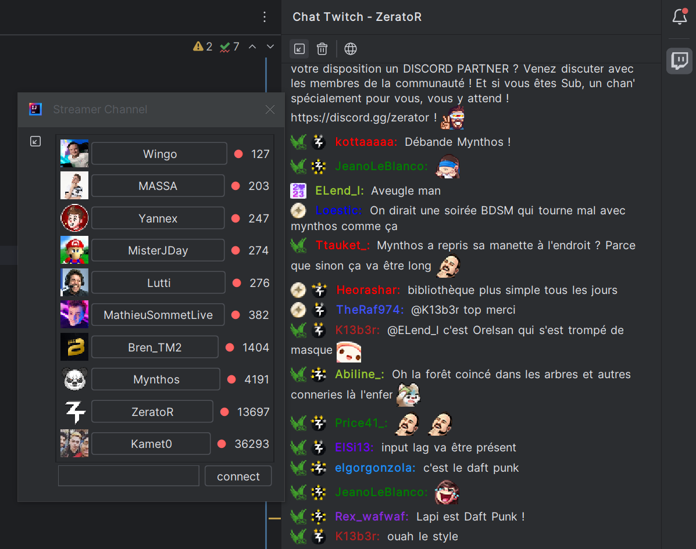

# IntelliTwitch : Plugin to see twitch chat on IntelliJ


IntelliTwitch is a Jetbrains IDE plugin to have a look at Twitch chanel

## Build the app

in twitch :
- register yourself in [dev.twitch.tv](https://dev.twitch.tv/)
- in you console, register an app
   - URL de redirection OAuth : `http://localhost:9856/oauth`
   - choose a `client id`
   - generate a `client secret`

for the project :
- clone the project
- in `src/main/resources` add a file named `twitchClient.json`
```json
{
  "CLIENT_ID": "your client id in twich",
  "CLIENT_SECRET": "the secret you generate"
}
```

you can now run it via `graddle`

## Roadmap (can evolve)

- ✅ Connect to twitch API
- ✅ Choose twitch channel to watch
- ✅ Read chat
- ✅ Write in chat
- ✅ Answer a chat message
- Moderate chat (delete message/ban user/...)
- ✅ Show user info in chat (badge/color/...)
- ✅ Support emote

## What it looks like
